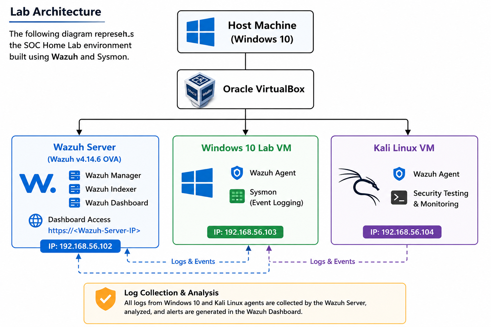
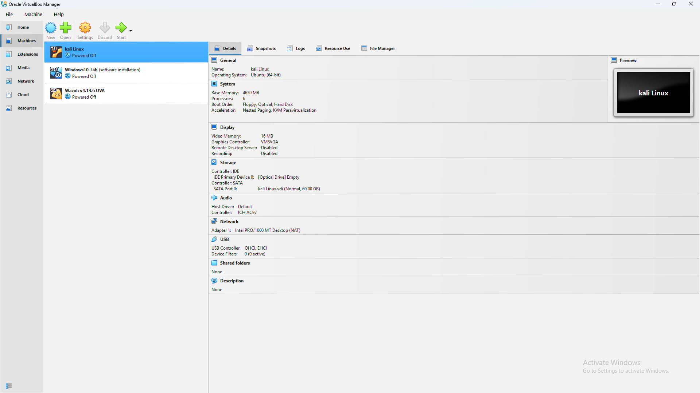

# Lab Setup

## Objective

The objective of this lab is to build a beginner-friendly Security Operations Center (SOC) environment using Wazuh and Sysmon for security monitoring, log collection, alert analysis, and hands-on learning.

---

## Lab Environment

| Component | Details |
|----------|---------|
| Host Operating System | Windows 10 |
| Virtualization Software | Oracle VirtualBox |
| Wazuh Version | 4.14.6 OVA |
| Endpoint 1 | Windows 10 Lab VM |
| Endpoint 2 | Kali Linux VM |
| Windows Monitoring | Wazuh Agent + Sysmon |
| Kali Monitoring | Wazuh Agent |

---

## Lab Architecture

The lab consists of one Wazuh server and two monitored endpoints.

- **Wazuh OVA** acts as the Manager, Indexer, and Dashboard.
- **Windows 10 Lab VM** is monitored using the Wazuh Agent and Sysmon.
- **Kali Linux VM** is monitored using the Wazuh Agent.
- Both endpoints send logs to the Wazuh Server for analysis.

---

## Lab Architecture Diagram

---

## VirtualBox Environment

The complete lab is hosted inside Oracle VirtualBox.

### Virtual Machines

| Virtual Machine | Purpose |
|----------------|---------|
| Wazuh v4.14.6 OVA | Manager, Indexer and Dashboard |
| Windows 10 Lab | Endpoint Monitoring |
| Kali Linux | Security Testing & Monitoring |

---

## VirtualBox Screenshot

---

## Learning Goals

During this lab I will learn:

- Wazuh Architecture
- Wazuh Agent Installation
- Sysmon Configuration
- Windows Event Monitoring
- Linux Log Monitoring
- Alert Investigation
- Regex Basics
- Custom Decoders
- Rule Creation

---

## Summary

This lab provides a complete beginner-friendly SOC environment for learning Wazuh. As I continue learning, this repository will be updated with new configurations, custom decoders, rules, and security monitoring use cases.
