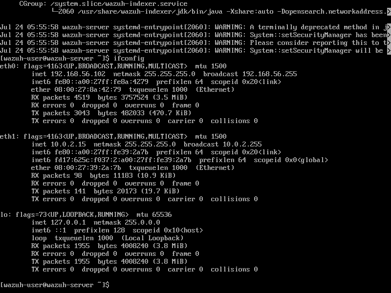
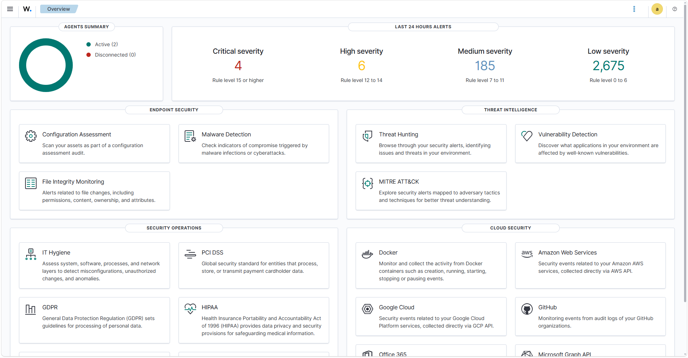

# Wazuh Installation

## Objective

The objective of this section is to document the installation and initial setup of the Wazuh server in my SOC Home Lab.

---

## Installation Method

I used the official **Wazuh v4.14.6 OVA** image and imported it into **Oracle VirtualBox**.

The OVA provides a pre-configured environment that includes:

- Wazuh Manager
- Wazuh Indexer
- Wazuh Dashboard

---

## Steps Performed

1. Downloaded the official Wazuh v4.14.6 OVA.
2. Imported the OVA into Oracle VirtualBox.
3. Powered on the virtual machine.
4. Logged in to the Wazuh server using the default credentials.
5. Verified that the Wazuh services were running.
6. Identified the IP address assigned to the Wazuh server.
7. Opened a web browser on the host machine.
8. Accessed the Wazuh Dashboard using the server IP address.
9. Logged in to the dashboard successfully.

---

## Commands Used

### Check Wazuh Manager

```bash
systemctl status wazuh-manager
```

### Check Wazuh Indexer

```bash
systemctl status wazuh-indexer
```

### Check Wazuh Dashboard

```bash
systemctl status wazuh-dashboard
```

### Check Server IP Address

```bash
ifconfig
```

---

## Verification

I confirmed that:

- All Wazuh services were running successfully.
- The server had a valid IP address.
- The Wazuh Dashboard was accessible from the host machine.
- I was able to log in successfully.

---

## Screenshots

### Wazuh Server



### Wazuh Dashboard



---

## Key Learnings

- Learned how to deploy the Wazuh OVA in Oracle VirtualBox.
- Verified Wazuh services using `systemctl`.
- Learned how to identify the server IP address.
- Accessed the Wazuh Dashboard through a web browser.
