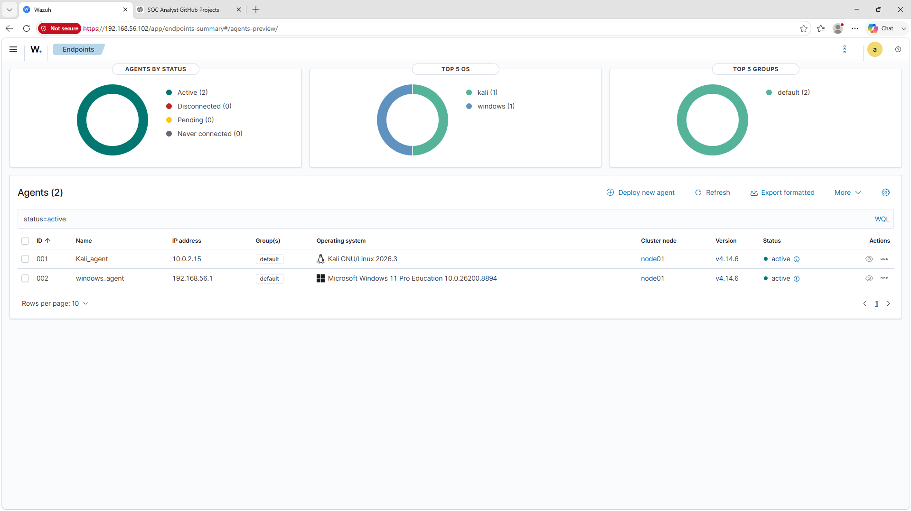

# Windows Endpoint Agent Deployment

## Objective

The objective of this task was to deploy and connect a **Windows 11 endpoint** with the **Wazuh Manager** for centralized log collection, endpoint monitoring, and security event analysis.

---

## Environment

| Component | Details |
|-----------|---------|
| Endpoint Operating System | Windows 11 Pro Education |
| Wazuh Agent Version | 4.14.6 |
| Wazuh Manager IP Address | 192.168.56.102 |
| Agent Group | Default |
| Communication Protocol | TCP |

---

## Steps Performed

### 1. Accessed Wazuh Dashboard

1. Logged into the Wazuh Dashboard.
2. Navigated to:

```
Endpoints → Deploy New Agent
```

---

### 2. Configured Agent Deployment

Selected the following options:

- **Operating System:** Windows
- **Wazuh Manager Address:** 192.168.56.102
- **Agent Group:** Default
- **Wazuh Agent Version:** 4.14.6

The Wazuh Dashboard automatically generated an installation command based on the selected operating system, manager address, and agent group.

---

## Agent Installation

The Windows agent was deployed using the **Deploy New Agent** feature available in the Wazuh Dashboard.

The generated installation command was executed in **Windows PowerShell as Administrator** to download, install, and register the Wazuh Agent with the Wazuh Manager.

### Installation Command

```powershell
Invoke-WebRequest `
-Uri https://packages.wazuh.com/4.x/windows/wazuh-agent-4.14.6-1.msi `
-OutFile $env:tmp\wazuh-agent-4.14.6-1.msi

msiexec.exe /i $env:tmp\wazuh-agent-4.14.6-1.msi `
WAZUH_MANAGER="192.168.56.102" `
WAZUH_AGENT_GROUP="default" `
/qn

NET START WazuhSvc
```

---

## Agent Service Verification

After installation, the Wazuh Agent service was started successfully.

Command used:

```powershell
NET START WazuhSvc
```

The service status was verified using:

```powershell
Get-Service WazuhSvc
```

The output confirmed that the Wazuh Agent service was running.

---

## Verification from Wazuh Dashboard

1. Returned to the Wazuh Dashboard.
2. Opened the **Endpoints** section.
3. Verified that the Windows endpoint was successfully registered.

The endpoint status was displayed as:

```
Active
```

The active status confirmed successful communication between the Windows endpoint and the Wazuh Manager.

---

## Screenshot

### Windows Agent Connected



---

## Key Learnings

- Learned how to deploy a Wazuh agent using the Dashboard deployment wizard.
- Understood the process of registering a Windows endpoint with the Wazuh Manager.
- Installed and configured the Wazuh Agent on a Windows 11 endpoint.
- Learned how endpoint agents communicate with the Wazuh Manager.
- Verified agent connectivity and status from the Wazuh Dashboard.
- Gained practical experience with SIEM-based endpoint monitoring and centralized log collection.

---

## Result

The Windows 11 endpoint was successfully integrated with the Wazuh environment.

The Wazuh Agent is actively communicating with the Wazuh Manager and is ready for security monitoring, event collection, and alert generation.
