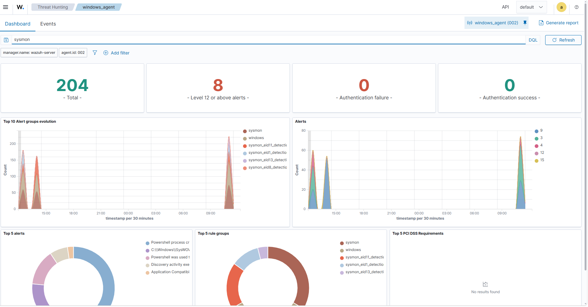

# Sysmon Integration with Wazuh

## Objective

The objective of this task was to integrate **Microsoft Sysmon** with the **Wazuh Agent** installed on the Windows endpoint.

Sysmon provides detailed system-level telemetry such as process creation, network connections, file creation, registry modifications, and other endpoint activities. Integrating Sysmon with Wazuh improves visibility and helps in detecting suspicious activities during security monitoring.

---

# Environment

| Component | Details |
|-----------|---------|
| Endpoint Operating System | Windows 11 Pro Education |
| Wazuh Agent Version | 4.14.6 |
| Wazuh Manager IP Address | 192.168.56.102 |
| Sysmon Version | 15.21 |
| Log Source | Microsoft-Windows-Sysmon/Operational |

---

# Prerequisites

Before starting the integration:

- Windows endpoint should be connected with the Wazuh Manager.
- Wazuh Agent service should be running.
- Administrator privileges are required on the Windows endpoint.

---

# Step 1: Download Sysmon

Sysmon was downloaded from the official Microsoft Sysinternals website.

Download location:

```
Microsoft Sysinternals - Sysmon
```

The downloaded ZIP file was extracted to:

```
C:\Tools\Sysmon
```

---

# Step 2: Install Sysmon

Opened **Windows PowerShell as Administrator**.

Navigated to the Sysmon directory:

```powershell
cd C:\Tools\Sysmon
```

Installed Sysmon using the configuration file:

```powershell
.\Sysmon64.exe -accepteula -i sysmonconfig.xml
```

After successful installation, Sysmon started monitoring system activity.

---

# Step 3: Verify Sysmon Installation

Checked the Sysmon service status:

```powershell
Get-Service Sysmon64
```

Expected output:

```
Status   Name       DisplayName
------   ----       -----------
Running  Sysmon64   Sysmon64
```

The running status confirmed that Sysmon was installed successfully.

---

# Step 4: Verify Sysmon Event Logs

Sysmon events were verified using Windows Event Viewer.

Navigation path:

```
Event Viewer
    ↓
Applications and Services Logs
    ↓
Microsoft
    ↓
Windows
    ↓
Sysmon
    ↓
Operational
```

The following Sysmon event IDs were observed:

| Event ID | Description |
|----------|-------------|
| Event ID 1 | Process Creation |
| Event ID 3 | Network Connection |
| Event ID 7 | Image Loaded |
| Event ID 11 | File Created |
| Event ID 13 | Registry Modification |

---

# Step 5: Configure Wazuh Agent for Sysmon Logs

The Wazuh Agent configuration file was modified to collect Sysmon event logs.

Configuration file location:

```
C:\Program Files (x86)\ossec-agent\ossec.conf
```

Added the following configuration:

```xml
<localfile>
  <location>Microsoft-Windows-Sysmon/Operational</location>
  <log_format>eventchannel</log_format>
</localfile>
```

This configuration allows the Wazuh Agent to collect Sysmon events from the Windows Event Channel.

---

# Step 6: Restart Wazuh Agent

Restarted the Wazuh Agent service to apply the configuration changes.

Command used:

```powershell
Restart-Service WazuhSvc
```

Verified the service status:

```powershell
Get-Service WazuhSvc
```

The Wazuh Agent continued running after the configuration update.

---

# Step 7: Generate Test Events

To verify Sysmon monitoring, several activities were performed on the Windows endpoint.

Examples:

### Process Creation

Opened PowerShell:

```powershell
powershell.exe
```

Opened Calculator:

```powershell
calc.exe
```

### Network Activity

Executed:

```powershell
ping google.com
```

These activities generated Sysmon events that were collected by the Wazuh Agent.

---

# Step 8: Verify Events in Wazuh Dashboard

Opened the Wazuh Dashboard and navigated to:

```
Threat Hunting
        ↓
Events
```

Searched for Sysmon-related events.

Search query:

```
sysmon
```

The collected events contained:

```
Microsoft-Windows-Sysmon/Operational
```

confirming successful Sysmon integration with Wazuh.

---

# Screenshot

## Sysmon Events in Wazuh Dashboard



---

# Key Learnings

- Learned how to install and configure Microsoft Sysmon on Windows.
- Understood the importance of endpoint telemetry in security monitoring.
- Integrated Sysmon logs with the Wazuh Agent.
- Learned how Windows Event Channels are collected by Wazuh.
- Observed process creation and network activity events through Sysmon.
- Improved endpoint visibility for threat detection and investigation.

---

# Result

Microsoft Sysmon was successfully integrated with the Wazuh Agent.

The Windows endpoint is now capable of generating detailed security telemetry, which is collected and analyzed by the Wazuh Manager for monitoring and threat detection.
