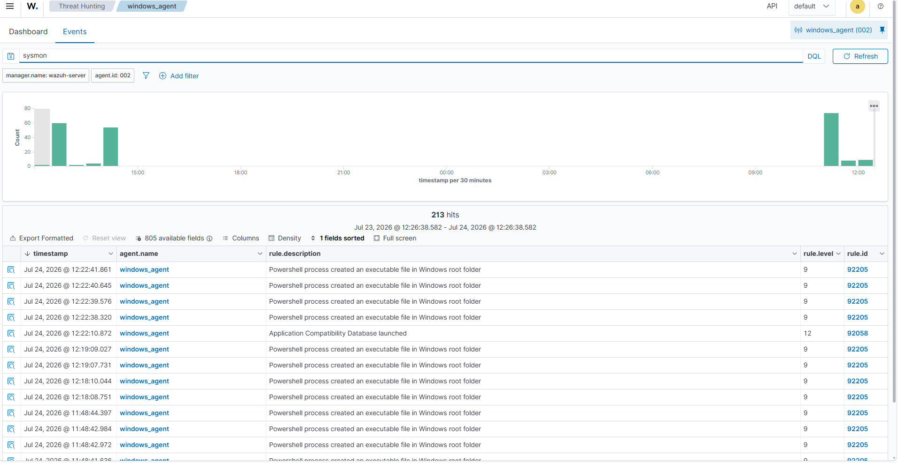

# Generating Security Logs

## Objective

The objective of this task was to generate different security-related activities on the Windows endpoint and verify that the logs were collected by the Wazuh Agent and forwarded to the Wazuh Manager.

These activities simulate real-world SOC monitoring scenarios such as authentication events, user management, process execution, and network activity.

---

## Environment

| Component | Details |
|-----------|---------|
| Endpoint Operating System | Windows 11 Pro Education |
| Wazuh Agent Version | 4.14.6 |
| Wazuh Manager IP Address | 192.168.56.102 |
| Log Sources | Windows Security Logs, Sysmon Logs |

---

# Log Generation Activities

## 1. Failed Login Attempt

### Purpose

To generate authentication failure events and observe unsuccessful login activity.

### Activity Performed

An incorrect password was entered multiple times during Windows login.

### Generated Event

```
Event ID: 4625
Description: An account failed to log on
```

Log Source:

```
Windows Security Logs
```

---


## 2. User Account Creation

### Purpose

To simulate account creation activity monitored by security teams.

### Command Executed

```powershell
net user testuser Password123 /add
```

### Generated Event

```
Event ID: 4720
Description: A user account was created
```

Log Source:

```
Windows Security Logs
```

---

## 3. PowerShell Execution

### Purpose

To generate process execution logs using PowerShell.

### Commands Executed

```powershell
whoami
```

```powershell
ipconfig
```

```powershell
systeminfo
```

### Generated Event

```
Sysmon Event ID: 1
Description: Process Creation
```

Log Source:

```
Microsoft-Windows-Sysmon/Operational
```

---

## 4. Network Activity

### Purpose

To generate network connection events.

### Command Executed

```powershell
ping google.com
```

### Generated Event

```
Sysmon Event ID: 3
Description: Network Connection
```

---

# Log Verification

Generated events were verified using Windows Event Viewer.

## Windows Security Logs

Path:

```
Event Viewer
→ Windows Logs
→ Security
```

## Sysmon Logs

Path:

```
Event Viewer
→ Applications and Services Logs
→ Microsoft
→ Windows
→ Sysmon
→ Operational
```

---

# Verification in Wazuh Dashboard

The collected logs were verified in the Wazuh Dashboard.

Navigation:

```
Wazuh Dashboard
→ Threat Hunting
→ Events
```

The generated events were visible with:

- Agent name
- Event timestamp
- Event description
- Log source

---

## Screenshot




---

# Key Learnings

- Learned how to generate security events on a Windows endpoint.
- Understood Windows Security Event IDs used for authentication and account monitoring.
- Learned how Sysmon captures detailed endpoint telemetry.
- Verified that Wazuh successfully collects Windows and Sysmon logs.
- Improved understanding of endpoint monitoring workflow.

---

# Result

Multiple security events were successfully generated on the Windows endpoint and collected by Wazuh.

The generated logs are ready for further investigation and alert analysis.
