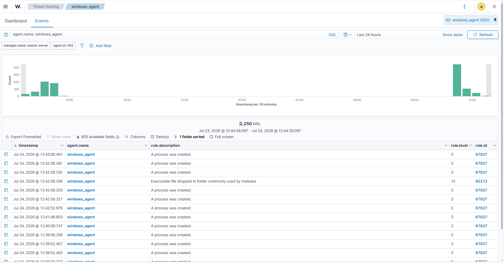
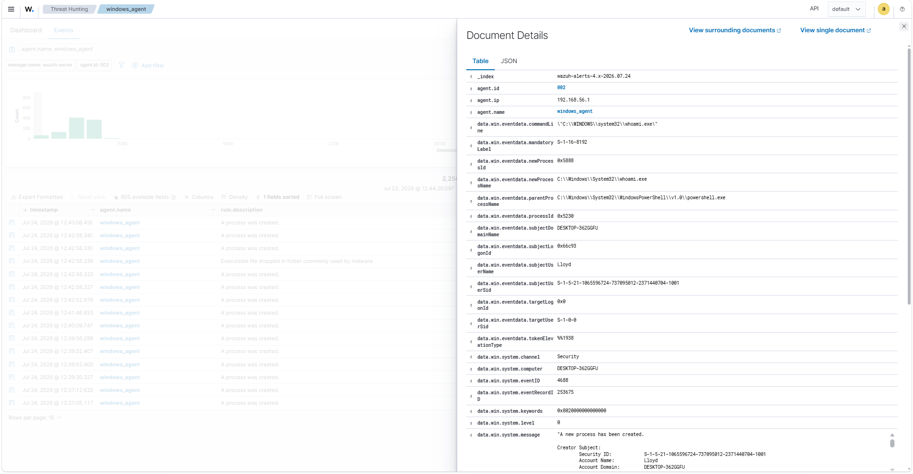

# Alert Analysis

## Objective

The objective of this task was to analyze security alerts generated by Wazuh after collecting logs from the Windows endpoint.

This process demonstrates the workflow followed by a SOC analyst to investigate security events by reviewing alert details, severity levels, rule information, and event data.

---

## Environment

| Component | Details |
|-----------|---------|
| Endpoint Operating System | Windows 11 Pro Education |
| Wazuh Agent Version | 4.14.6 |
| Wazuh Manager IP Address | 192.168.56.102 |
| Log Sources | Windows Event Logs, Sysmon Logs |

---

# Alert Generation Workflow

The alert generation process follows the flow:

```
Windows Activity
        ↓
Windows Event Logs / Sysmon Logs
        ↓
Wazuh Agent
        ↓
Wazuh Manager
        ↓
Detection Rules
        ↓
Security Alert
```

Wazuh analyzes collected events using detection rules and generates alerts based on the type and severity of the detected activity.

---

# Accessing Wazuh Alerts

The generated alerts were analyzed from the Wazuh Dashboard.

Navigation:

```
Wazuh Dashboard
        ↓
Threat Hunting
        ↓
Events
```

The events were filtered using the Windows endpoint agent to identify security-related activities.

---

## Wazuh Alert Overview

The alert overview provides important information about detected events, including:

| Field | Description |
|------|-------------|
| Timestamp | Time when the event occurred |
| Agent Name | Endpoint that generated the event |
| Rule ID | Detection rule responsible for the alert |
| Rule Level | Severity level of the alert |
| Rule Description | Explanation of detected activity |
| Event Source | Source of collected logs |

---

## Screenshot



---

# Alert Details Analysis

Each alert was expanded to analyze detailed event information.

The following details were reviewed:

- Event timestamp
- Agent information
- Rule information
- Event description
- Log source
- Additional event data

These details help a SOC analyst understand the activity that triggered the alert and determine whether further investigation is required.

---

## Screenshot



---

# Alert Investigation Approach

The following steps were followed during alert investigation:

1. Identified the affected endpoint.
2. Reviewed the alert severity level.
3. Checked the detection rule and description.
4. Analyzed the collected event data.
5. Identified the process or activity responsible for generating the event.
6. Determined whether the activity was expected or suspicious.

---

# Key Learnings

- Learned how Wazuh generates alerts from collected endpoint logs.
- Understood the importance of rule IDs and severity levels during investigation.
- Learned how to analyze alert details from the Wazuh Dashboard.
- Improved understanding of SOC alert triage workflow.
- Learned how endpoint activities are converted into actionable security alerts.

---

# Result

Security alerts generated from the Windows endpoint were successfully analyzed using the Wazuh Dashboard.

The alert investigation process provided practical experience in monitoring, analyzing, and understanding security events in a SIEM environment.
